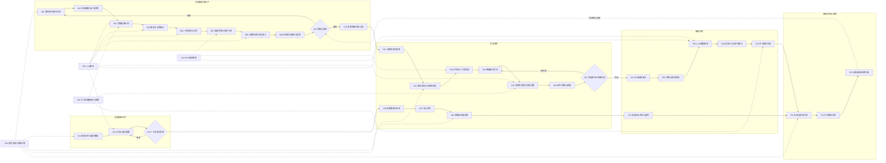
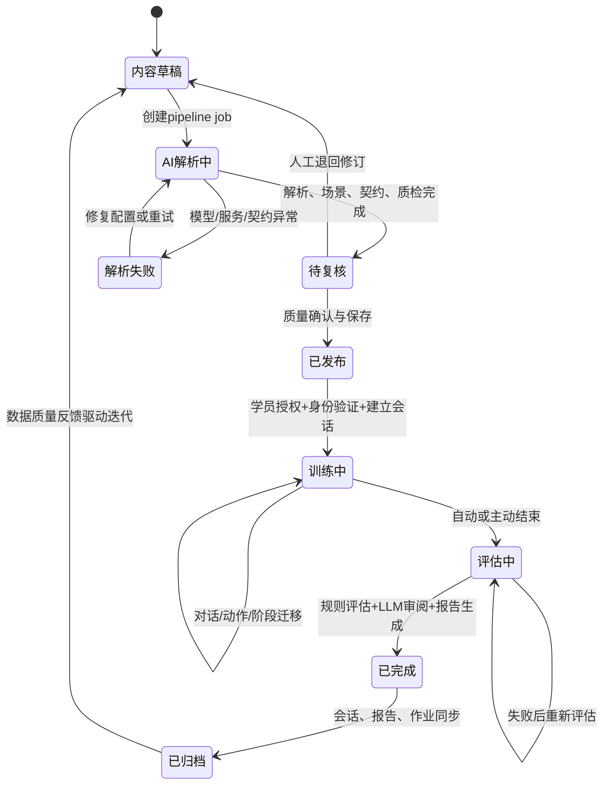
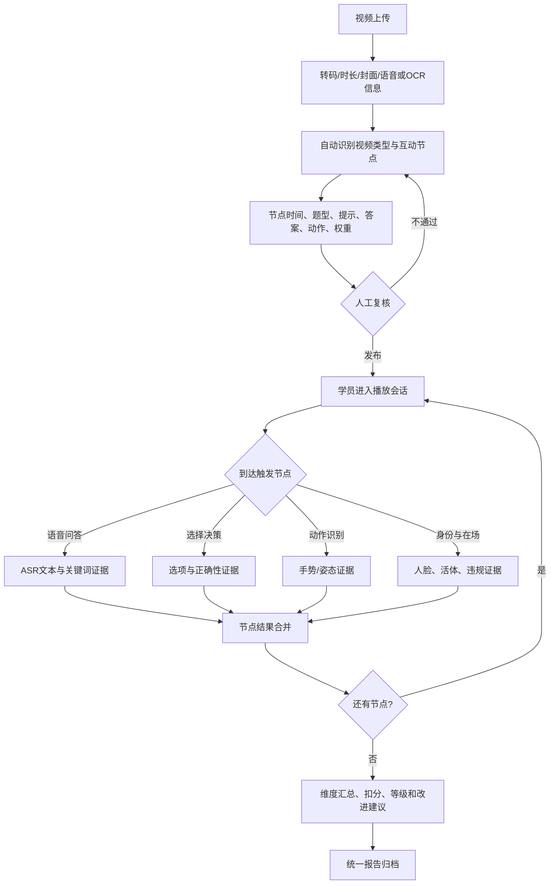

# AI训练全链路业务技术拆解与质量评估

> 基线日期：2026-08-14
> 评估范围：案件AI对话训练、视频节点训练、智能评估、报告归档及横向AI支撑服务
> 评估基线：当前工作区代码、`data/ai_police.db`运行样本和现有架构文档；未将设计声明直接视为已落地能力

## 1. 评估口径

### 1.1 业务目标

平台全链路目标不是单次生成案件或单次给出分数，而是形成“素材进入、内容生产、人工治理、训练执行、证据采集、智能评估、结果归档、反向优化”的可审计闭环。平台当前存在两条训练主线：

- 案件AI对话训练：以案件文本或文件为起点，生成事实账本、人物记忆、场景和训练契约，驱动多角色对话训练与自适应评分。
- 视频节点训练：以教学或互动视频为起点，自动分析并配置训练节点，采集语音、动作、身份和页面行为证据，形成视频训练报告。

### 1.2 六维质量模型

每个节点按百分制评估，六维等权：

| 维度 | 定义 | 主要判据 |
|---|---|---|
| 精准度 P | 输出与源材料、规则及警务语义的一致性 | 事实引用、规则命中、误判控制、主体边界 |
| 稳定性 S | 持续运行、异常处置与恢复能力 | 幂等、超时、重试、降级、状态恢复 |
| 完整性 C | 输入、处理、输出、审核和审计覆盖程度 | 字段覆盖、流程闭环、证据与状态留存 |
| 智能化 I | 推理、生成、动态适配和自动决策能力 | LLM、多智能体、自适应策略、自动编排 |
| 实用性 U | 与真实警务训练及管理工作匹配程度 | 可操作性、可复核性、角色适配、教学价值 |
| 效率 E | 自动化收益和时间、人力转化效率 | 自动处理比例、人工复核成本、响应时延 |

`当前综合分 = (P + S + C + I + U + E) / 6`。目标成熟度为节点完成本报告优化项后的预期综合分，不代表当前能力。

证据等级：`A`=代码与数据库样本双验证；`B`=代码实现验证、样本不足；`C`=接口或配置存在但闭环不足；`D`=规划能力或明显空缺。

## 2. 端到端业务闭环

### 2.1 L0全景流程

### 2.2 案件AI对话训练状态闭环

### 2.3 视频节点训练闭环

## 3. 节点统一技术拆解

### 3.1 内容输入与AI内容生产

| 节点 | 技术框架与底层模块 | 核心能力/技能 | 提示词体系与约束 | 当前运行效果 |
|---|---|---|---|---|
| A01 案件/知识素材上传 | Vue 3、Element Plus、FastAPI multipart、对象存储适配；案件支持文本和文件，知识库独立路由 | 素材接收、格式校验、权限校验、来源登记、异步任务创建 | 无生成式Prompt；接口约束文件类型、大小、用户权限和输入非空 | 输入入口完整；案件、知识、视频分属不同模型，统一素材资产目录不足 |
| A02 文档抽取与正文清洗 | `document_extract_service`、DOCX/PDF解析、OCR、`compact_case_source`、规则清洗 | 文本提取、长文压缩、附录剔除、噪声识别、截断审计 | 无生成式Prompt；规则排除目录、审判套话、证据目录及文档标记；保留原文与清洗统计 | 支持多格式和大文本审计；规则清洗对复杂版式、扫描质量敏感 |
| B01 完整剧情生成 | 独立AI Workflow FastAPI、`CompleteStorySkill`、DeepSeek适配器、修复重试 | 时间线重组、主支线还原、纪实叙事、覆盖度检测、低质量修复 | 系统Prompt要求Markdown长文、硬事实不变、冲突说法保留来源、禁止法庭化扩写；修复Prompt针对遗漏和压缩不足补写 | 具备生成、质量审计和规则兜底；文学性补充仍存在事实漂移风险，依赖模型可用性 |
| B02 事实与关系解析 | `FactAnalysisSkill`、Pydantic `CaseWorld/Fact`、原子事实回退抽取 | 原子事实、时间线、地点、关系、来源引用、知情边界抽取 | 仅输出JSON；事实拆为单一行为/陈述/证据；`source_quote`须逐字来自剧情；不得虚构 | 已建立事实ID和引用；模型失败时按句切分，结构质量显著下降，引用回退可能指向整篇文档 |
| B03 人物知识与记忆 | `PersonMemorySkill`、角色紧凑契约、角色信息管理、事实ID绑定 | 对话角色筛选、已知/隐藏事实、五类记忆、回答边界、来源记忆 | 仅输出JSON；排除法官等非警情角色；每条记忆必须引用合法事实ID；只能表达本人已知范围 | 能形成可追溯角色知识边界；规则兜底的人名识别和记忆类型默认值可能过度泛化 |
| B04 故事世界与知识入库 | 案件知识仓储、命名空间节点、ChromaDB/RAG、结构化JSON持久化 | 故事世界组装、事实卡、角色记忆、知识清单、检索索引 | 无直接生成Prompt；写入前进行schema规范化、命名空间隔离和知识来源标记 | 同时保留可读剧情和结构化事实；Embedding不可用时降级为本地向量/词法检索，语义召回质量不稳定 |
| B05 必要场景生成与准入 | `CaseImportHarnessAgent`、场景蓝图规范化、对话场景准入、必要场景选择器 | 训练目标拆分、场景去重、角色最小化、事实绑定、非对话场景过滤 | 仅输出JSON；1至4个必要场景；学员固定一线处置民警；禁止检察/法庭/量刑场景；人物和事实必须来自CaseWorld | 具备边界、数量和准入约束；模型异常会生成规则兜底场景，场景针对性与真实性下降 |
| B06 训练契约编译与质检 | 场景生命周期、`training_compiler_service`、场景契约、质量报告 | 阶段编译、考察点、动作目录、完成条件、结束条件、状态机、可观测评分规则 | 无单独Prompt；对AI蓝图执行确定性规范化、ID去重、事实绑定和契约校验 | 产物较完整，可直接驱动训练；质量报告已生成，但与发布硬门禁的绑定仍不充分 |

### 3.2 内容治理与分发

| 节点 | 技术框架与底层模块 | 核心能力/技能 | 提示词体系与约束 | 当前运行效果 |
|---|---|---|---|---|
| C01 管理员复核 | 案件编辑页、事实账本、角色档案、场景训练契约、流水线进度组件 | 原文与生成物复核、角色修订、场景修订、考察点管理、质量问题查看 | 无生成式Prompt；人工决策优先于自动补全，保存时执行schema迁移与一致性修复 | 已具备较丰富的可编辑面；审核清单与签署责任尚未完全标准化，质量报告未形成统一阻断策略 |
| C02 发布/班级任务分发 | 案件状态、班级、任务、场景关联、学员覆盖与截止策略 | 发布、撤回、班级分发、场景排序、迟交策略、个体覆盖 | 无生成式Prompt；通过角色权限、状态和任务关联控制可见范围 | 支持大厅训练和班级作业；内容版本冻结与发布后变更影响追踪不足 |

### 3.3 案件AI对话训练

| 节点 | 技术框架与底层模块 | 核心能力/技能 | 提示词体系与约束 | 当前运行效果 |
|---|---|---|---|---|
| D01 训练发现与授权 | 学员大厅、班级任务接口、JWT/RBAC、截止与迟交策略 | 场景发现、任务授权、完成状态、续训入口 | 无生成式Prompt；校验发布状态、任务归属、学员身份和时间策略 | 可覆盖自主训练与作业训练；大厅部分统计仍使用前端模拟数据 |
| D02 身份验证与会话初始化 | InsightFace、ONNX活体、FaceVerificationEvent、TrainingSession、初始四维状态 | 人证一致、活体检测、异常计数、会话复用、初始角色状态装配 | 无生成式Prompt；未通过身份验证不得生成开场；状态值规范到0至100 | 身份门禁已进入对话主链路；模型、摄像头和光照会影响可用性，训练附件样本当前为空 |
| D03 开场与上下文装配 | 场景角色解析、角色记忆、事实账本、最近20条对话、RAG引用、会话运行态 | 首轮角色选择、公开事件装配、知识最小化、开场台词生成 | 角色开场Prompt限定身份、可说事实、行为、150字、不得反问、仅输出JSON | 能按场景和角色生成开场；上下文来源多，版本兼容与字段别名增加装配复杂度 |
| D04 智能提问引导 | `training_view_service`、自定义问法、缺失考察项、前端快捷提问 | 推荐问法、缺失项提示、最多5条引导 | 当前不是独立LLM Prompt；规则为自定义问法优先，再将前三个缺失项拼为“请问…？” | 可用但智能化较低；接报顺序反馈为空实现，缺少基于对话意图、阶段和角色状态的动态追问策略 |
| D05 多角色仿真与状态迁移 | Orchestrator、RoleSimulationSkill、TinyTroupe、PoliceTrainingWorld、世界快照、四维状态机 | 多角色选择、公开事件广播、角色内在记忆、台词、事实披露、情绪/配合/风险/清晰度迁移 | 角色仿真Prompt受人物记忆、事实ID、场景目标、当前阶段和回答边界约束；台词只取TinyTroupe `TALK`，LLM不得二次改写 | 架构隔离和角色边界较强；每轮模型调用成本高，TinyTroupe与模型依赖会放大时延和失败概率 |
| D06 动作/考察点进度 | 动作API、文本动作识别、`collect_stage_progress`、运行态JSON | 显式动作提交、自然语言动作识别、关键词证据、考察点hit/partial/missed、可用动作更新 | 无生成式Prompt；以动作ID、关键词、学员主动发言和阶段规则作为确定性证据 | 可实时显示阶段进度；关键词和字符串规则对同义表达、否定语义及组合动作识别有限 |
| D07 阶段推进与结束判定 | 阶段状态机、completion rules、end conditions、自动评估触发 | 阶段完成、强制追问、下一阶段、收尾检测、自动结束、主动结束 | 模型只提出状态迁移建议，平台按允许迁移表落库；结束还受必考点、最后阶段和收尾关键词约束 | 已形成训练到评估的自动流转；自然语言收尾仍有关键词兜底，异常中断会留下active/evaluating会话 |

### 3.4 对话智能评估与归档

| 节点 | 技术框架与底层模块 | 核心能力/技能 | 提示词体系与约束 | 当前运行效果 |
|---|---|---|---|---|
| E01 对话证据聚合 | 消息表、运行态、动作结果、知识引用、训练时间与场景信息 | 聚合全量对话、学员轮次、完成动作、规则发现、报告头 | 无生成式Prompt；过滤内部Prompt，限定正式评估输入来自已持久化会话 | 输入来源清晰；截图、录音等训练附件尚无实际样本，证据形态以文本和动作ID为主 |
| E02 考察点规则判定 | `evaluate_points`、考察点去重、关键词/动作规则、难度映射 | hit/partial/missed判定、证据摘录、必考项完成率、同义考察点合并 | 无生成式Prompt；确定性规则先于LLM，考察点ID、关键词、动作ID和required属性为约束 | 可解释且可复算；复杂语义依赖关键词，partial比例存在规则化估计 |
| E03 LLM辅助审阅 | EvaluationSkill、DeepSeek JSON审阅、知识引用 | 通用四维评语、优势、改进项、总体建议 | 仅输出JSON；只依据结构化对话和考察点；不得自行计算最终总分 | LLM只负责定性审阅，降低分数漂移；模型不可用时可生成规则报告，但评语个性化下降 |
| E04 动态计分与封顶审计 | adaptive weighting、四个通用维度、考察点难度权重、红线规则、cap audit | 动态分配100分、必考完成率封顶、轮次封顶、红线行为封顶、等级计算 | 无生成式Prompt；最终分数由确定性引擎计算并校验版本、总分和封顶审计 | 当前最成熟节点之一，规则透明且可追溯；权重和阈值仍缺教官标注集、信效度及跨场景校准 |
| E05 正式报告生成 | ReportSkill、评估策略版本校验、重新评估接口 | 报告组装、版本验证、成绩明细、证据、建议、生成时间 | 报告Skill复用成熟评估结果，不允许重新计算分数；旧格式仅做兼容组装 | 已实现评估到报告的两阶段编排；历史数据存在多版本，旧报告需迁移或重新评估 |
| F01 会话与报告归档 | TrainingSession、VideoTrainingSession、Message、Artifact、evaluation_result JSON | 会话状态、消息、报告、违规、媒体产物持久化 | 无生成式Prompt；平台拥有正式成绩和归档，AI服务只保留工作流状态 | 对话和视频均能归档报告；两类会话模型分离，统一训练档案和证据生命周期治理不足 |
| F02 作业提交同步 | AssignmentSubmission、训练会话关联、成绩与状态同步 | 自动提交、完成时间、成绩回写、教官复核入口 | 无生成式Prompt；仅在报告有效后同步，异常同步不阻塞正式报告保存 | 基本闭环已建立；当前运行样本很少，失败补偿和后台重放能力需加强 |
| F03 历史/画像/运营分析 | 学员历史、画像维度、问题聚合、趋势、管理员会话和运营统计 | 历史查询、能力维度、场景表现、问题分类、改进建议、数据质量观察 | 部分建议为规则模板，无统一画像生成Prompt；聚合依赖正式报告字段 | 已提供多个分析视图；跨两类训练的统一能力模型、内容效果反哺和版本对比尚未完成 |

### 3.5 视频节点训练

| 节点 | 技术框架与底层模块 | 核心能力/技能 | 提示词体系与约束 | 当前运行效果 |
|---|---|---|---|---|
| V01 视频上传与媒体解析 | FastAPI上传、ffmpeg/ffprobe调用、对象存储、封面、ASR、OCR | 媒体校验、时长与封面、音轨转写、静默视频OCR兜底、播放转码 | 无统一生成Prompt；媒体大小、类型、时长和处理状态受接口约束 | 支持较完整媒体管线；重型OCR/ASR与转码依赖环境，处理时延和资源消耗高 |
| V02 AI节点自动配置 | `video_auto_config_service`、LLM结构化分析、模板兜底 | 视频类型识别、内容摘要、节点时间、互动方式、标准答案、动作与权重生成 | JSON Prompt要求依据转写/OCR证据生成节点；节点时间合法、类型受枚举限制；无有效内容时使用模板 | 可显著降低人工配置成本；静默或识别失败时退化为均匀时间点和场景模板，准确度有限 |
| V03 视频人工复核与发布 | 视频编辑器、节点增删改排序、发布开关、播放准备状态 | 节点校正、交互方式、答案、提示、权重和发布控制 | 无生成式Prompt；管理员编辑优先，发布前依赖媒体和节点配置状态 | 控件较完整；缺统一质检清单和节点覆盖度硬门禁，大量视频仍处于草稿状态 |
| V04 视频播放与会话 | HLS/原视频回退、VideoTrainingSession、断点与当前节点 | 播放准备、训练模式、节点暂停、进度记录、异常回退 | 无生成式Prompt；按触发时间和暂停模式驱动节点 | 支持分段播放和原视频回退；播放准备、浏览器媒体策略与网络环境影响稳定性 |
| V05 节点交互 | 语音问答、选择题、动作任务、重试/跳过、AI教官提示 | 多题型作答、计时、重试扣分、跳过扣分、节点证据提交 | AI提示来自节点配置；答案、关键词、正确选项、动作类型和超时构成判定约束 | 交互形态丰富；不同题型的评分口径仍由兼容字段桥接，配置复杂度较高 |
| V06 多模态证据采集 | Web Speech/Qwen实时语音、MediaPipe手势/姿态、人脸活体、页面违规、摄像录制 | ASR、关键词、手势、身份在场、活体、失焦/离开、录制证据 | 无生成式Prompt；按通道生成标准化evidence payload和degradation列表 | 语音、动作、人脸已有接入；表情、专注度、动作序列模型未接入，当前采用代理指标兜底 |
| V07 视频节点评估与报告 | `video_assessment_service`、节点规则、维度汇总、人工复核接口 | 多通道证据合并、节点考察点判定、得分扣减、能力维度、报告输出 | 无生成式Prompt为主；依据channel/mode规则判定，缺规则则明确missed；兼容对话报告字段 | 可输出结构化报告并允许管理员复核；规则驱动强、AI定性能力弱，降级通道影响评分可信度 |

### 3.6 横向支撑服务

| 节点 | 技术框架与底层模块 | 核心能力/技能 | 提示词体系与约束 | 当前运行效果 |
|---|---|---|---|---|
| S01 LLM服务 | OpenAI兼容SDK、DeepSeek主适配、供应商回退、JSON解析与修复 | 文本生成、结构化输出、模型切换、限流超时处理 | 统一system/user分层、JSON schema约束、最大token、有限重试；密钥不进入AI工作流payload | 支持主备和解析修复；历史失败包含未配置密钥、超时和5xx，仍是全链路核心单点风险 |
| S02 RAG知识服务 | ChromaDB、Embedding、词法回退、案件命名空间、知识库同步 | 法规与案件知识写入、语义检索、来源返回、降级检索 | 检索阶段无生成式Prompt；返回文档、元数据、相关度和降级标记 | 有可用降级路径；本地确定性向量不等同语义Embedding，缺少召回率与答案引用正确率基准 |
| S03 工作流隔离/审计/幂等 | 独立AI服务、HTTP契约、trace ID、idempotency key、JSON状态存储、审计日志 | 服务隔离、状态恢复、重复请求保护、迁移建议、节点审计 | Orchestrator按阶段选择Skill；Skill只能提出状态迁移，平台校验并持久化 | 架构边界清晰；Agent状态为文件存储，生产级并发、检索和集中可观测能力有限 |
| S04 语音/视觉/对象存储 | 语音供应商、MediaPipe、InsightFace/ONNX、MinIO或本地存储、媒体资产表 | 输入输出媒体、身份、动作、语音、训练附件统一支撑 | 无统一生成式Prompt；通过MIME、大小、所有者类型、质量阈值和降级状态约束 | 能支撑多模态训练；各能力成熟度不一致，附件留存、隐私期限和删除策略需统一治理 |

## 4. Prompt体系标准化

### 4.1 Prompt分层模型

| 层级 | 作用 | 必备字段 | 禁止项 |
|---|---|---|---|
| P0 安全与事实边界 | 固定角色、警务边界、数据权限 | 事实来源、角色知识范围、不可回答项、敏感规则 | 新增硬事实、越权写成绩、泄露内部字段 |
| P1 业务任务 | 定义节点唯一任务 | 目标、输入对象、操作范围、成功条件 | 同一Prompt混合解析、评分和发布决策 |
| P2 上下文 | 装配最小必要信息 | CaseWorld、角色记忆、场景、阶段、有限历史、知识引用 | 全库注入、无关角色、数据库凭据 |
| P3 输出契约 | 保证机器可消费 | JSON字段、枚举、ID引用、长度、编码 | 自由格式夹杂说明、未经约束的Markdown |
| P4 自检与修复 | 校验覆盖、引用和一致性 | schema校验、事实ID校验、覆盖率、错误码 | 静默吞错、把兜底输出标记为AI成功 |

### 4.2 Prompt登记表

| Prompt ID | 对应节点 | 输入 | 核心指令 | 输出 | 关键质量门禁 |
|---|---|---|---|---|---|
| PR-01 完整剧情 | B01 | 清洗后原文 | 还原时间线、主支线与处置收束，保持纪实风格 | Markdown完整剧情 | 硬事实不变、冲突说法保留、禁止法庭化扩写 |
| PR-02 剧情修复 | B01 | 原文、低质量剧情、审计结果 | 补齐遗漏、扩大覆盖、修正结构 | 修复后Markdown | 章节、长度、人物与后半材料覆盖 |
| PR-03 事实解析 | B02 | 完整剧情 | 抽取原子事实、时间地点、关系和来源 | CaseWorld JSON | 引用逐字匹配、事实ID唯一、不得虚构 |
| PR-04 人物记忆 | B03 | 剧情、事实账本 | 生成可对话人物、知识边界和来源记忆 | Persons/Memory JSON | 事实ID白名单、排除非对话角色、五类记忆枚举 |
| PR-05 场景蓝图 | B05 | CaseWorld、剧情 | 生成1至4个必要警情处置训练场景 | SceneBlueprint JSON | 一线民警视角、角色最小化、事实绑定、对话准入 |
| PR-06 角色开场 | D03 | 角色、场景、剧情、可说事实 | 以角色身份主动陈述当前事实或诉求 | utterances JSON | 150字、不得反问、不得念字段、事实边界 |
| PR-07 多角色仿真 | D05 | 全部角色、状态、场景、公开历史 | 选择必要角色行动并生成台词与状态变化 | reply turns/state results | 台词仅来自角色、每轮最多6人、未披露事实不可越界 |
| PR-08 评估审阅 | E03 | 对话、考察点结果、知识引用 | 给出通用维度评语、优势和改进建议 | Review JSON | 不计算总分、不新增证据、只评价已有输入 |
| PR-09 视频配置 | V02 | 元数据、转写、OCR、时长 | 识别类型并生成互动节点 | Video/Node JSON | 时间合法、类型枚举、答案与证据一致、允许明确降级 |

当前最大Prompt缺口是D04智能提问引导：应新增“阶段目标 + 未完成考察点 + 已问内容 + 角色当前状态 + 禁止泄题”约束的推荐问题生成器，并保留规则生成作为降级路径。

## 5. 节点质量量化评判

### 5.1 评分总表

| 节点 | P | S | C | I | U | E | 当前综合 | 目标综合 | 证据 |
|---|---:|---:|---:|---:|---:|---:|---:|---:|---|
| A01 素材上传 | 88 | 86 | 82 | 45 | 88 | 84 | 78.8 | 91 | B |
| A02 抽取清洗 | 78 | 76 | 80 | 62 | 82 | 79 | 76.2 | 90 | B |
| B01 完整剧情 | 76 | 68 | 82 | 88 | 80 | 83 | 79.5 | 91 | B |
| B02 事实解析 | 78 | 72 | 84 | 86 | 85 | 82 | 81.2 | 92 | B |
| B03 人物记忆 | 77 | 73 | 83 | 88 | 86 | 81 | 81.3 | 92 | B |
| B04 知识入库 | 74 | 78 | 82 | 76 | 82 | 77 | 78.2 | 90 | B |
| B05 场景生成准入 | 80 | 74 | 87 | 88 | 88 | 82 | 83.2 | 93 | B |
| B06 契约编译质检 | 84 | 82 | 90 | 78 | 90 | 86 | 85.0 | 94 | B |
| C01 管理员复核 | 85 | 82 | 78 | 55 | 88 | 70 | 76.3 | 91 | B |
| C02 发布分发 | 88 | 85 | 83 | 48 | 90 | 85 | 79.8 | 92 | A |
| D01 训练发现授权 | 89 | 86 | 79 | 40 | 88 | 87 | 78.2 | 90 | A |
| D02 身份与会话 | 82 | 76 | 80 | 78 | 83 | 75 | 79.0 | 91 | B |
| D03 开场上下文 | 80 | 74 | 85 | 87 | 87 | 78 | 81.8 | 92 | B |
| D04 智能提问引导 | 65 | 88 | 52 | 35 | 66 | 76 | 63.7 | 91 | B |
| D05 多角色仿真 | 79 | 66 | 87 | 92 | 89 | 61 | 79.0 | 92 | B |
| D06 动作与进度 | 76 | 82 | 85 | 62 | 84 | 86 | 79.2 | 91 | B |
| D07 推进与结束 | 79 | 78 | 86 | 74 | 85 | 84 | 81.0 | 92 | A |
| E01 证据聚合 | 82 | 83 | 69 | 55 | 78 | 86 | 75.5 | 91 | A |
| E02 规则判定 | 79 | 88 | 87 | 68 | 86 | 91 | 83.2 | 93 | B |
| E03 LLM审阅 | 76 | 72 | 80 | 86 | 82 | 80 | 79.3 | 91 | B |
| E04 计分封顶 | 86 | 90 | 92 | 78 | 91 | 92 | 88.2 | 95 | A |
| E05 正式报告 | 88 | 85 | 88 | 63 | 90 | 89 | 83.8 | 94 | A |
| F01 统一归档 | 82 | 81 | 70 | 48 | 78 | 83 | 73.7 | 92 | A |
| F02 作业同步 | 86 | 76 | 72 | 46 | 82 | 80 | 73.7 | 90 | B |
| F03 画像运营 | 72 | 78 | 67 | 58 | 75 | 73 | 70.5 | 91 | B |
| V01 视频解析 | 77 | 70 | 84 | 72 | 82 | 70 | 75.8 | 90 | B |
| V02 AI节点配置 | 70 | 69 | 78 | 84 | 78 | 85 | 77.3 | 91 | B |
| V03 视频复核发布 | 83 | 82 | 70 | 50 | 85 | 74 | 74.0 | 90 | A |
| V04 播放与会话 | 82 | 78 | 82 | 58 | 84 | 80 | 77.3 | 91 | A |
| V05 节点交互 | 80 | 78 | 85 | 69 | 86 | 82 | 80.0 | 92 | B |
| V06 多模态证据 | 65 | 66 | 68 | 76 | 70 | 67 | 68.7 | 92 | B |
| V07 视频评估报告 | 74 | 80 | 82 | 62 | 79 | 86 | 77.2 | 92 | B |
| S01 LLM服务 | 76 | 61 | 78 | 90 | 82 | 70 | 76.2 | 93 | A |
| S02 RAG服务 | 68 | 76 | 75 | 72 | 74 | 74 | 73.2 | 91 | B |
| S03 隔离审计幂等 | 90 | 82 | 86 | 77 | 88 | 81 | 84.0 | 94 | B |
| S04 多模态与存储 | 73 | 70 | 70 | 75 | 76 | 69 | 72.2 | 92 | B |

### 5.2 评分依据与主要结论

- 全链路优势：AI服务与平台状态所有权明确；案件事实、角色记忆、场景均使用结构化契约；训练状态迁移由平台控制；最终评分由确定性引擎计算并带封顶审计。
- 核心瓶颈：上游模型服务稳定性、推荐提问的低智能化、多模态真实模型缺口、发布质量门禁不统一、跨训练类型归档与画像模型分裂。
- 历史运行侧证：数据库记录65个案件流水线任务，48个完成、17个失败，历史完成率73.8%；失败包含服务不可用、模型密钥缺失、超时、5xx和历史代码错误，不能直接代表当前提交版本。
- 训练侧证：115个对话会话中73个finished、5个evaluating、37个active；76个会话含评估JSON，74个含数值总分，历史策略版本并存。
- 视频侧证：61个视频中9个已发布、52个草稿；7个视频训练会话中4个完成；样本量不足以证明视频评估稳定性。
- 归档侧证：训练附件表当前无样本，说明媒体证据接口已存在但尚未形成可验证的常态化留存闭环。

## 6. 闭环缺口与优化路线

### 6.1 P0：直接影响训练与评分可信度

| 优化项 | 涉及节点 | 落地动作 | 量化验收 |
|---|---|---|---|
| 建立统一发布质量门禁 | B06、C01、C02、V03 | 将事实引用、必要角色、阶段完整、必考点、结束条件、视频节点规则纳入可配置阻断策略 | 严重质量项阻断率100%；发布内容均带门禁版本和审核人 |
| 建立AI流水线可靠性SLO | B01-B05、S01、S03 | 统一超时、错误码、有限重试、任务恢复、模型配置预检和告警 | 案件任务成功率≥95%；P95处理时间有监控；配置错误在任务前发现 |
| 校准评分信效度 | E02-E04、V07 | 建立教官双盲标注集，评估机器与教官一致率，按场景校准阈值和权重 | 总分相关系数≥0.80；等级一致率≥85%；关键红线召回率≥95% |
| 补齐多模态真实能力 | V06、S04 | 接入或删除表情、专注度、动作序列等名义指标；禁止代理指标冒充真实识别结果 | 报告逐通道标明真实/代理/缺失；有效通道覆盖率≥90% |

### 6.2 P1：提升训练完整性与教学效率

| 优化项 | 涉及节点 | 落地动作 | 量化验收 |
|---|---|---|---|
| 动态智能提问引导 | D04 | 新增阶段感知Prompt与规则兜底，输入未完成考察点、已问内容、角色状态，输出不泄题的追问建议 | 重复推荐率≤5%；无关推荐率≤10%；必考点引导覆盖率≥90% |
| 统一训练证据模型 | E01、F01、V06 | 统一文本、动作、语音、视觉、违规证据schema及来源、时间、质量、保留期限 | 所有评分项可追溯到标准证据ID；孤儿附件率为0 |
| 统一训练档案与画像 | F01-F03 | 建立跨对话/视频的能力维度映射、版本化报告仓库和内容效果分析 | 两类训练统一画像覆盖率100%；可按评分版本重算和对比 |
| 发布版本冻结 | C02、V03、F01 | 发布内容生成不可变版本；会话关联具体版本；编辑产生新版本 | 历史会话可100%还原当时内容与评分规则 |

### 6.3 P2：架构收敛与运营优化

| 优化项 | 涉及节点 | 落地动作 | 量化验收 |
|---|---|---|---|
| 收敛新旧解析逻辑 | A02-B06 | 以CaseImportHarness为唯一主入口，逐步移除`workflow_service.py`重复Prompt与场景兜底 | 同类Prompt唯一来源；重复解析路径减少至1条主链路 |
| RAG质量基准 | B04、S02 | 构建事实和法规检索集，评估Recall@K、引用正确率和降级影响 | Recall@5≥90%；引用正确率≥95%；降级状态可监控 |
| 内容效果反哺 | C01、F03 | 将高频失分、场景完成率、异常退出、教官复核结果回写内容治理看板 | 每个发布版本具备训练量、完成率、区分度和问题分布 |
| 成本与时延治理 | D05、S01 | 记录每轮token、模型调用、角色数量、缓存命中和端到端时延 | 对话P95≤8秒；单会话模型成本可追踪并具预算告警 |

## 7. 标准化验收指标

| 层级 | 指标 | 目标 |
|---|---|---:|
| 内容生产 | 案件流水线成功率 | ≥95% |
| 内容生产 | 原子事实可追溯率 | 100% |
| 内容生产 | 场景事实越界率 | 0% |
| 内容治理 | 严重质量项发布阻断率 | 100% |
| 训练运行 | 对话轮次成功率 | ≥99% |
| 训练运行 | 自动恢复后重复推进率 | 0% |
| 智能引导 | 推荐问题有效率 | ≥90% |
| 智能评估 | 教官与AI等级一致率 | ≥85% |
| 智能评估 | 评分项证据可追溯率 | 100% |
| 视频训练 | 多模态有效通道覆盖率 | ≥90% |
| 归档 | 报告、会话、内容版本关联完整率 | 100% |
| 运营 | 异常会话闭环处理率 | ≥95% |

## 8. 最终评估结论

平台已经形成可运行的双训练业务骨架，其中案件AI对话链路在结构化内容生产、多角色仿真、确定性评分和封顶审计方面成熟度较高，具备从管理端输入到正式报告归档的主闭环。当前系统不宜被描述为“完全自动化生产”：管理员质量复核仍是必要控制点，动态提问、多模态真实识别、统一证据归档、跨训练画像和生产级SLO是主要短板。

近期建设应优先保证“输入可追溯、发布有门禁、训练可恢复、评分有证据、报告可还原”，再提高模型生成丰富度。只有当评分校准集、发布版本冻结和运行SLO同时落地后，平台的AI内容生产能力才可从功能可用提升到规模化、标准化和可审计运营。
