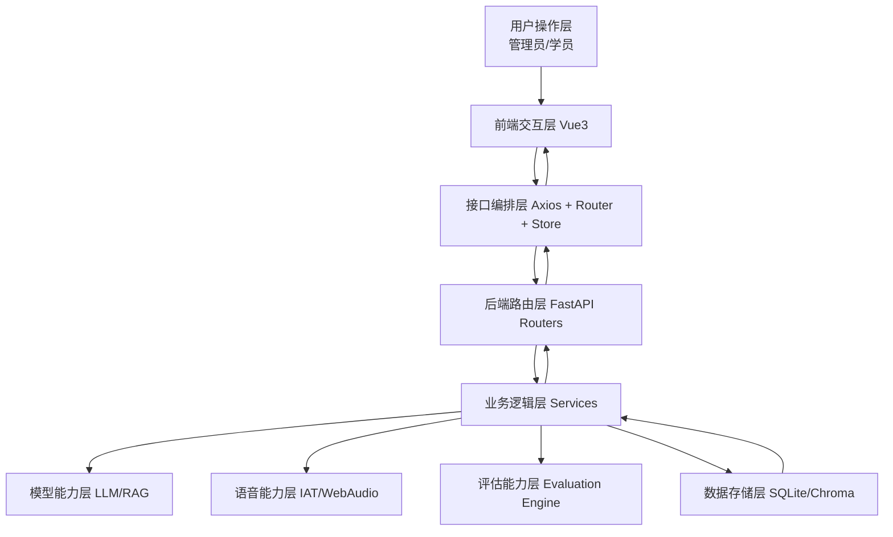

# 260601项目情况说明（先看）

> 适用对象：接手开发者、技术负责人、实施运维  
> 更新时间：2026-06-01

## 1. 项目定位与当前状态

`AI虚拟警情处置模拟训练平台` 是一个面向警情处置训练的教学系统，核心链路为：

1. 管理端录入案件并生成场景、角色、考察点  
2. 学员端进入场景进行多轮对话训练（含语音输入）  
3. 系统按考察点进行结构化评估并沉淀训练记录

当前代码已具备可运行主流程（案件 -> 训练 -> 评估 -> 历史回看），并支持本地开发和 Docker 部署。

---

## 2. 技术栈与关键依赖

### 2.1 后端

- 框架：FastAPI
- ORM：SQLAlchemy
- 鉴权：python-jose + passlib
- 向量库：ChromaDB
- LLM 接入：OpenAI SDK 兼容层（DeepSeek / Qwen）
- 文档解析：python-docx、pypdf
- 配置：python-dotenv / pydantic-settings
- 数据库：SQLite（默认），可切换 PostgreSQL

### 2.2 前端

- 框架：Vue 3 + TypeScript
- 构建：Vite
- 状态：Pinia
- 路由：Vue Router
- UI：Vant + Tailwind
- 网络：Axios
- 文件处理：xlsx

### 2.3 语音能力

- 实时识别：科大讯飞 IAT（WebSocket）
- 浏览器录音与可视化：Web Audio API
- 语音链路包含共享麦克风、波形绘制、PCM 编码与结果解析策略

---

## 3. 目录结构（整理后建议认知）

```text
backend/                 # FastAPI 服务与业务核心
  routers/               # 路由层（cases/training/student/speech...）
  services/              # 业务服务层（AI、评估、工作流、数据质量）
  models.py              # ORM 模型
  schemas.py             # Pydantic 模型
  main.py                # 应用入口

frontend/                # Vue 管理端 + 学员端
  src/views/             # 页面（Cases/StudentTraining/Roles...）
  src/components/        # 通用组件
  src/services/          # API 与语音服务
  src/composables/       # 复用逻辑

docs/                    # 项目文档
  交接文档/               # 交接说明（本文件）
  archive/legacy/        # 历史资料归档占位

deploy/ scripts/         # 部署与打包辅助脚本
```

---

## 4. 用户触发到系统执行的工作流（框架图）



---

## 5. 核心业务逻辑分层

### 5.1 交互层（UI）

- 管理端：案件录入、角色配置、场景配置、考察点评估配置
- 学员端：场景训练、实时输入、建议提示、训练结果查看

### 5.2 逻辑层（Backend Services）

- `workflow_service`：案件解析后结构规范化
- `case_schema_service`：角色字段规范化（canonical + alias）
- `persona_engine`：角色动态行为调整（鲜活度增强）
- `evaluation_service`：按考察点完成情况进行评分
- `data_quality_service`：一致性巡检、冲突与残留字段检测

### 5.3 数据层

- 结构化业务数据：SQLite（用户、案件、场景、训练记录）
- 语义检索与知识召回：ChromaDB

---

## 6. 当前已实现能力（可对外说明）

- 管理端完整链路：案件录入 -> AI 补全 -> 角色/场景编辑 -> 发布
- 学员训练链路：进入案件 -> 多轮对话 -> 训练结束 -> 评估结果
- 评估机制：已切换到“考察点完成情况”驱动评分
- 角色鲜活度：支持基于阶段与状态的动态 persona 调整
- 语音输入：支持科大讯飞 ASR 接入与本地波形显示
- Docker 部署：根目录 `Dockerfile + docker-compose.yml` 可用

---

## 7. 仍欠缺/未完全实现项

- 自动化测试覆盖不足（前端组件测试、端到端流程测试缺失）
- 权限边界较粗（管理端与学员端仍需更细粒度权限策略）
- 生产级监控未完善（日志聚合、告警规则、性能指标）
- 语音链路在弱网/长会话场景的容错策略仍可加强
- 默认账号密码策略偏弱（需在首次部署后强制替换）

---

## 8. 优化优先级建议（接手后 2~4 周）

### P0（立即）

1. 补充配置安全基线：强制 `.env` 本地化、部署时密钥校验
2. 移除或改造默认账号初始密码策略（避免生产误用）
3. 增加关键 API 冒烟测试（案件发布、训练、评估）

### P1（近期）

1. 为评估链路增加回归测试数据集（稳定评分表现）
2. 前端页面继续做“信息降噪”与一致性设计收敛
3. 语音服务增加异常重试与状态可视化

### P2（中期）

1. 引入任务队列（异步处理大文档解析与批量评估）
2. 引入可观测性方案（请求链路、耗时、错误分类）
3. 支持多租户/多院校组织结构

---

## 9. 运行与交付注意事项

- 前端开发端口使用 `5175`（非默认 5173）
- 后端健康检查：`/healthz`
- 不要提交真实密钥：仅提交 `.env.example`
- 推荐仅使用根目录部署入口：`docker compose up -d --build`
- 上传仓库前确认不包含：`node_modules`、`venv`、数据库文件、日志、临时导出文件

---

## 10. 接手建议（第一天）

1. 本地拉起前后端，走通“案件录入 -> 学员训练 -> 评估结果”全链路
2. 阅读以下文件顺序：
   - `README.md`
   - `docs/03-技术方案摘要.md`
   - `backend/services/evaluation_service.py`
   - `frontend/src/views/Cases.vue`
   - `frontend/src/views/StudentTraining.vue`
3. 先补测试与安全基线，再做功能迭代，避免“边改边坏”

