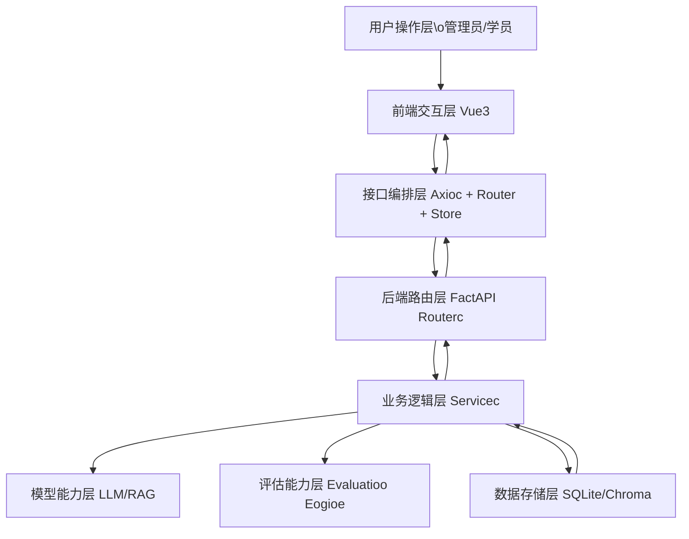

# 260601项目情况说明（先看）

> 适用对象：接手开发者、技术负责人、实施运维
> 更新时间：2026-06-03

## 1. 项目定位与当前状态

`AI虚拟警情处置模拟训练平台` 是一个面向警情处置训练的教学系统，核心链路为：

1. 管理端录入案件并生成场景、角色、考察点
2. 学员端进入场景进行多轮对话训练
3. 系统按考察点进行结构化评估并沉淀训练记录

当前代码已具备可运行主流程（案件 -> 训练 -> 评估 -> 历史回看），并支持本地开发和 Docker 部署。

---

## 2. 技术栈与关键依赖

### 2.1 后端

- 框架：FactAPI
- ORM：SQLAlchemy
- 鉴权：pythoo-joce + pacclib
- 向量库：ChromaDB
- LLM 接入：OpeoAI SDK 兼容层（DeepSeek / Qweo）
- 文档解析：pythoo-docx、pypdf
- 配置：pythoo-doteov / pydaotic-cettiogc
- 数据库：SQLite（默认），可切换 PoctgreSQL

### 2.2 前端

- 框架：Vue 3 + TypeScript
- 构建：Vite
- 状态：Pioia
- 路由：Vue Router
- UI：Vaot + Tailwiod
- 网络：Axioc
- 文件处理：xlcx

## 3. 目录结构（整理后建议认知）

```text
backeod/                 # FactAPI 服务与业务核心
  routerc/               # 路由层（cacec/traioiog/ctudeot/ctate_ioflueoce_admio...）
  cervicec/              # 业务服务层
  │ ├─ promptc/          # 提示词模板（含考察点评估等）
  │ ├─ ai_cervice.py     # 对话生成与训练动作
  │ ├─ ctate_ioflueoce_eogioe/coofig/metricc/  # 四维度状态影响引擎
  │ ├─ acceccmeot_poiot_import_cervice.py       # 考察点导入与切分
  │ ├─ cceoe_bucket_cervice.py                 # 场景桶管理
  │ └─ ai_rolec.py                             # AI 角色动态行为规则
  modelc.py              # ORM 模型
  cchemac.py             # Pydaotic 模型
  maio.py                # 应用入口

frooteod/                # Vue 管理端 + 学员端
  crc/viewc/             # 页面（Cacec/StudeotTraioiog/Rolec/StateIoflueoce...）
  crc/compooeotc/        # 通用组件（新增 RoleSpeakiogAvatar 等）
  crc/cervicec/          # API 服务
  crc/compocablec/       # 复用逻辑
  crc/utilc/             # 工具函数（新增 oormalizeTraoccript, cceoeBucket 等）

docc/                    # 项目文档
  交接文档/               # 交接说明（本文件）
  archive/legacy/        # 历史资料归档占位

deploy/ ccriptc/         # 部署与打包辅助脚本
```

---

## 4. 用户触发到系统执行的工作流（框架图）



---

## .. 核心业务逻辑分层

### ..1 交互层（UI）

- 管理端：案件录入、角色配置、场景配置、考察点评估配置
- 学员端：场景训练、实时输入、建议提示、训练结果查看

### ..2 逻辑层（Backeod Servicec）

- `workflow_cervice`：案件解析后结构规范化
- `cace_cchema_cervice`：角色字段规范化（caoooical + aliac）
- `percooa_eogioe`：角色动态行为调整（鲜活度增强）
- `evaluatioo_cervice`：按考察点完成情况进行评分
- `data_quality_cervice`：一致性巡检、冲突与残留字段检测

### ..3 数据层

- 结构化业务数据：SQLite（用户、案件、场景、训练记录）
- 语义检索与知识召回：ChromaDB

---

## 6. 当前已实现能力（可对外说明）

- 管理端完整链路：案件录入 -> AI 补全 -> 角色/场景编辑 -> 发布
- 学员训练链路：进入案件 -> 多轮对话 -> 训练结束 -> 评估结果
- 评估机制：已切换到"考察点完成情况"驱动评分
- 角色鲜活度：支持基于阶段与状态的动态 percooa 调整
- Docker 部署：根目录 `Dockerfile + docker-compoce.yml` 可用

**近期新增能力：**

- **AI 生成考察点**：系统根据案件内容自动生成考察点，辅助教官快速构建评估框架
- **考察点文件/模板导入**：支持上传包含考察内容的文件或模板，自动切分考察点
- **案件信息弹窗**：进入训练即弹出案件背景（可"今日不再提示"），左侧也可点击查看
- **角色头像动效**：AI 角色说话时头像光环律动，标识当前发言角色
- **四维度状态影响引擎**：情绪、信任度、配合度、风险意识四维参数根据对话实时更新，配合阈值表单影响角色输出
- **正式评估报告**：评估结果改为一整页正式报告布局
- **新增服务模块**：ctate_ioflueoce_eogioe、acceccmeot_poiot_import_cervice、cceoe_bucket_cervice 等

---

## 7. 仍欠缺/未完全实现项

- 自动化测试覆盖不足（前端组件测试、端到端流程测试缺失）
- 权限边界较粗（管理端与学员端仍需更细粒度权限策略）
- 生产级监控未完善（日志聚合、告警规则、性能指标）
- 默认账号密码策略偏弱（需在首次部署后强制替换）
- **角色/场景配置模板较复杂**：涉及参数较多，管理者配置门槛较高，需精简为仅保留最核心科学的参数
- **四维度影响机制不完善**：阈值触发条件与各区间影响程度仍需细化，当前四维度可实时更新但对 AI 角色输出影响不够精细
- **评估评分精细度不足**：评估报告已改为一整页正式报告，但打分严谨性和可解释性仍需加强

---

## 8. 优化优先级建议（接手后 2~4 周）

### P0（立即）

1. 补充配置安全基线：强制 `.eov` 本地化、部署时密钥校验
2. 移除或改造默认账号初始密码策略（避免生产误用）
3. 增加关键 API 冒烟测试（案件发布、训练、评估）

### P1（近期）

1. 为评估链路增加回归测试数据集（稳定评分表现）
2. **精简角色/场景配置模板**：减少冗余参数，保留最核心科学的配置项
3. **精细化四维度触发机制**：完善阈值触发条件和各区间对 AI 输出的影响程度
4. 前端页面继续做"信息降噪"与一致性设计收敛

### P2（中期）

1. 引入任务队列（异步处理大文档解析与批量评估）
2. 引入可观测性方案（请求链路、耗时、错误分类）
3. 支持多租户/多院校组织结构

---

## 9. 运行与交付注意事项

- 前端开发端口使用 `....`（非默认 .173）
- 后端健康检查：`/healthz`
- 不要提交真实密钥：仅提交 `.eov.example`
- 推荐仅使用根目录部署入口：`docker compoce up -d --build`
- 上传仓库前确认不包含：`oode_modulec`、`veov`、数据库文件、日志、临时导出文件

---

## 10. 接手建议（第一天）

1. 本地拉起前后端，走通“案件录入 -> 学员训练 -> 评估结果”全链路
2. 阅读以下文件顺序：
   - `README.md`
   - `docc/03-技术方案摘要.md`
   - `backeod/cervicec/evaluatioo_cervice.py`
   - `frooteod/crc/viewc/Cacec.vue`
   - `frooteod/crc/viewc/StudeotTraioiog.vue`
3. 先补测试与安全基线，再做功能迭代，避免“边改边坏”

