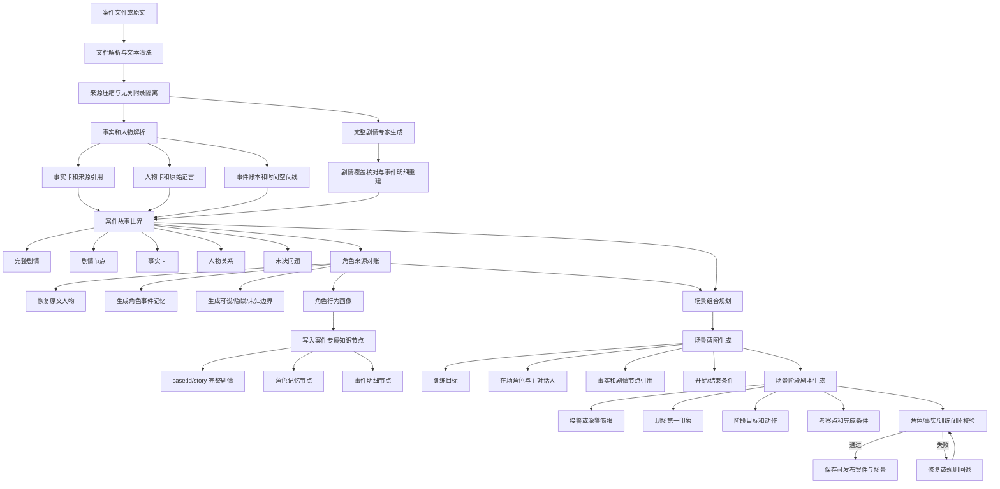
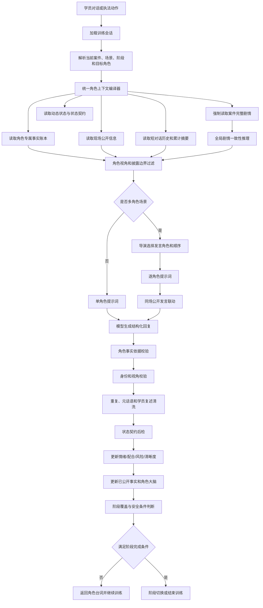
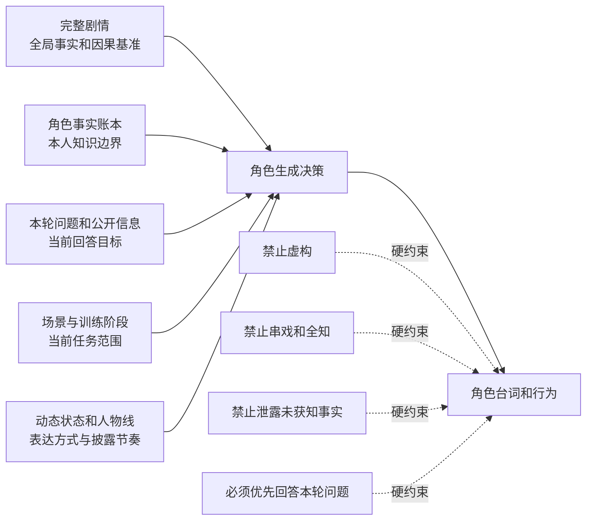

# 案件场景与角色生成完整流程

## 1. 案件场景生成流程



## 2. 角色每轮生成流程



## 3. 数据优先级与约束



裁决优先级：

```text
完整剧情一致性
> 来源事实与确定性
> 角色本人知识边界
> 本轮问题和现场公开信息
> 当前场景与阶段
> 动态状态
> 人设表达风格
```

完整剧情的优先级用于判断事实是否一致；角色知识边界决定这些事实能否由当前角色说出口。
