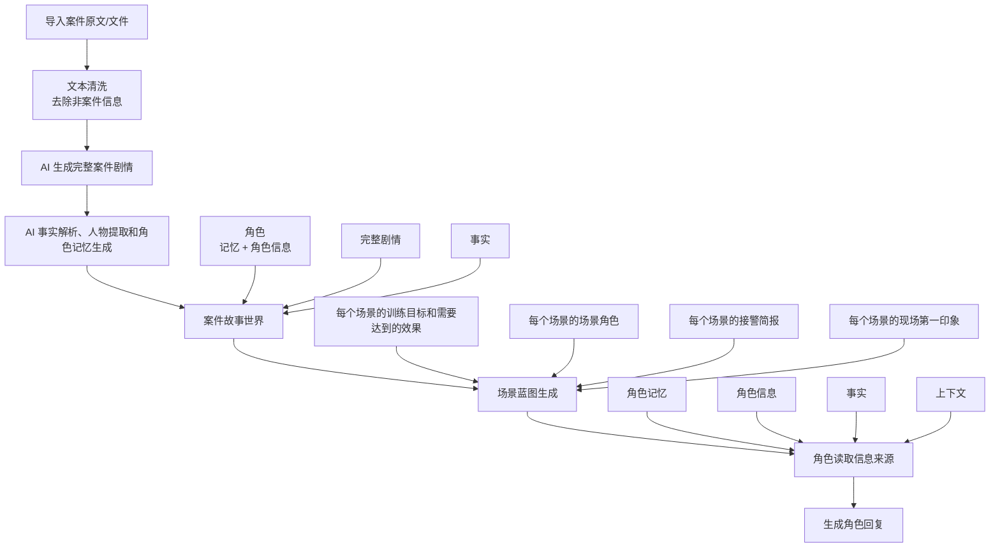

# 案件场景与角色生成完整流程

## 新版主流程

## 执行顺序

1. 导入案件原文或文件。
2. 对文本做清洗，只保留案件训练相关信息。
3. 先由 AI 生成完整案件剧情，作为后续事实抽取和业务流转的主基准。
4. 基于完整案件剧情执行 AI 事实解析、AI 人物提取，并生成角色长期记忆。
5. 构建案件故事世界，仅承载角色、角色记忆、角色信息、完整剧情和事实；不再参与业务逻辑加工处理。
6. 基于完整剧情、事实和角色记忆生成场景蓝图；每个场景只保留训练目标、需要达到的效果、场景角色、接警简报和现场第一印象等核心信息。
7. 角色对话时读取角色记忆、角色信息、事实和上下文，生成自然回复。

## 边界

案件故事世界用于业务数据存储、指标统计和页面排版渲染。事件账本、时间线/空间线、人物关系图、事实引用、可观察完成条件、场景剧本和台词契约校验不再作为主业务流水线节点。
